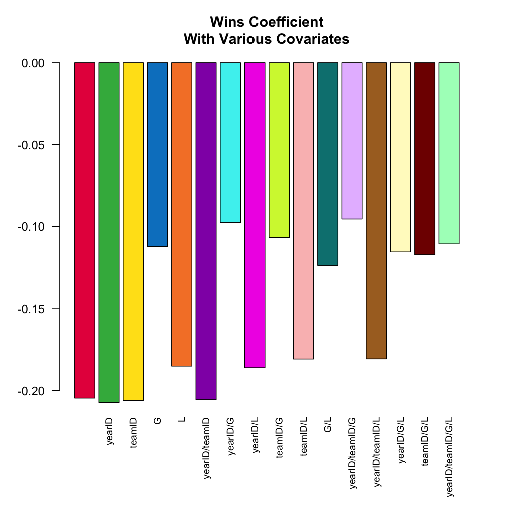
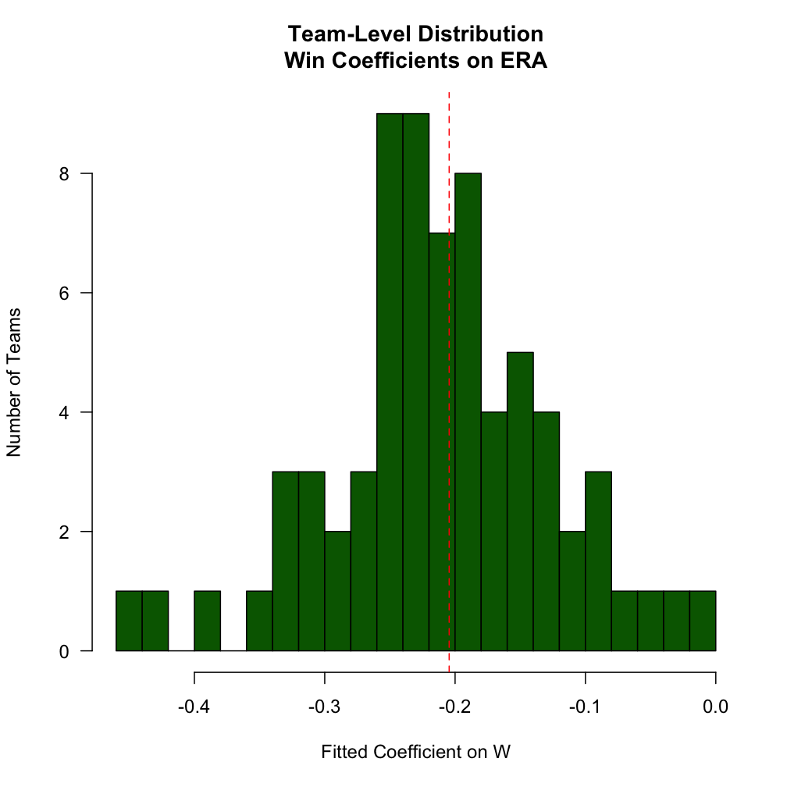

Cette vignette explique les manières habituelles d'utiliser la variable `.SD` dans vos analyses de `data.table` . C'est une adaptation ce [cette réponse](https://stackoverflow.com/a/47406952/3576984) donnée sur StackOverflow.

# C'est quoi `.SD` ?

Au sens large, `.SD` est simplement un raccourci pour capturer une variable qui apparait fréquemment dans le contexte de l'analyse de données. Il faut comprendre *S* pour *S*ubset, *S*elfsame, ou *S*elf-reference et *D* pour *D*onnée. Ce qui donne, `.SD` qui dans sa forme la plus basique est une *référence réflexive* de la `data.table` elle-même -- comme nous le verrons dans les exemples ci-dessous,  ceci est particulièrement utile pour chaîner ensemble les "requêtes" (extractions/sous-ensembles/etc... en utilisant `[`). E particulier cela signifie aussi que *`.SD` est lui-même une `data.table`* (avec la mise en garde qu'il ne peut être assigné avec `:=`).

L'utilisation la plus simple de `.SD` est pour le sous-ensemble de colonnes (i.e., quand `.SDcols` est spécifié) ; comme cette version est beaucoup plus simple à comprendre, nous allons la couvrir en premier ci-dessous. L'interprétation de `.SD` dans sa seconde utilisation, les scénarios de regroupement (i.e., quand `by = ` ou `keyby = ` est spécifié), est légèrement différente, conceptuellement (bien qu'au fond ce soit la même chose, puisque, après tout, une opération non regroupée est un cas limite de regroupement avec un seul groupe).

## Charger et afficher les données Lahman

Pour rendre cela un peu plus concret, plutôt que de modifier les données, chargeons quelques ensembles de données concernant le baseball à partir de la [base de données Lahman](https://github.com/cdalzell/Lahman). Dans R typiquement, nous aurions simplement chargé ces ensembles de données du package R `Lahman`; dans cette vignette, nous les avons préchargés à la place, directement à partir de la page GitHub du package.


```r
load('Teams.RData')
setDT(Teams)
Teams
#       yearID   lgID teamID franchID  divID  Rank     G Ghome     W     L DivWin  WCWin  LgWin
#        <int> <fctr> <fctr>   <fctr> <char> <int> <int> <int> <int> <int> <char> <char> <char>
#    1:   1871     NA    BS1      BNA   <NA>     3    31    NA    20    10   <NA>   <NA>      N
#    2:   1871     NA    CH1      CNA   <NA>     2    28    NA    19     9   <NA>   <NA>      N
#    3:   1871     NA    CL1      CFC   <NA>     8    29    NA    10    19   <NA>   <NA>      N
#    4:   1871     NA    FW1      KEK   <NA>     7    19    NA     7    12   <NA>   <NA>      N
#    5:   1871     NA    NY2      NNA   <NA>     5    33    NA    16    17   <NA>   <NA>      N
#   ---                                                                                        
# 2891:   2018     NL    SLN      STL      C     3   162    81    88    74      N      N      N
# 2892:   2018     AL    TBA      TBD      E     3   162    81    90    72      N      N      N
# 2893:   2018     AL    TEX      TEX      W     5   162    81    67    95      N      N      N
# 2894:   2018     AL    TOR      TOR      E     4   162    81    73    89      N      N      N
# 2895:   2018     NL    WAS      WSN      E     2   162    81    82    80      N      N      N
#        WSWin     R    AB     H   X2B   X3B    HR    BB    SO    SB    CS   HBP    SF    RA    ER
#       <char> <int> <int> <int> <int> <int> <int> <num> <int> <num> <num> <num> <int> <int> <int>
#    1:   <NA>   401  1372   426    70    37     3    60    19    73    16    NA    NA   303   109
#    2:   <NA>   302  1196   323    52    21    10    60    22    69    21    NA    NA   241    77
#    3:   <NA>   249  1186   328    35    40     7    26    25    18     8    NA    NA   341   116
#    4:   <NA>   137   746   178    19     8     2    33     9    16     4    NA    NA   243    97
#    5:   <NA>   302  1404   403    43    21     1    33    15    46    15    NA    NA   313   121
#   ---                                                                                           
# 2891:      N   759  5498  1369   248     9   205   525  1380    63    32    80    48   691   622
# 2892:      N   716  5475  1415   274    43   150   540  1388   128    51   101    50   646   602
# 2893:      N   737  5453  1308   266    24   194   555  1484    74    35    88    34   848   783
# 2894:      N   709  5477  1336   320    16   217   499  1387    47    30    58    37   832   772
# 2895:      N   771  5517  1402   284    25   191   631  1289   119    33    59    40   682   649
#         ERA    CG   SHO    SV IPouts    HA   HRA   BBA   SOA     E    DP    FP
#       <num> <int> <int> <int>  <int> <int> <int> <int> <int> <int> <int> <num>
#    1:  3.55    22     1     3    828   367     2    42    23   243    24 0.834
#    2:  2.76    25     0     1    753   308     6    28    22   229    16 0.829
#    3:  4.11    23     0     0    762   346    13    53    34   234    15 0.818
#    4:  5.17    19     1     0    507   261     5    21    17   163     8 0.803
#    5:  3.72    32     1     0    879   373     7    42    22   235    14 0.840
#   ---                                                                         
# 2891:  3.85     1     8    43   4366  1354   144   593  1337   133   151 0.978
# 2892:  3.74     0    14    52   4345  1236   164   501  1421    85   136 0.986
# 2893:  4.92     1     5    42   4293  1516   222   491  1121   120   168 0.980
# 2894:  4.85     0     3    39   4301  1476   208   551  1298   101   138 0.983
# 2895:  4.04     2     7    40   4338  1320   198   487  1417    64   115 0.989
#                          name                          park attendance   BPF   PPF teamIDBR
#                        <char>                        <char>      <int> <int> <int>   <char>
#    1:    Boston Red Stockings           South End Grounds I         NA   103    98      BOS
#    2: Chicago White Stockings       Union Base-Ball Grounds         NA   104   102      CHI
#    3:  Cleveland Forest Citys  National Association Grounds         NA    96   100      CLE
#    4:    Fort Wayne Kekiongas                Hamilton Field         NA   101   107      KEK
#    5:        New York Mutuals      Union Grounds (Brooklyn)         NA    90    88      NYU
#   ---                                                                                      
# 2891:     St. Louis Cardinals             Busch Stadium III    3403587    97    96      STL
# 2892:          Tampa Bay Rays               Tropicana Field    1154973    97    97      TBR
# 2893:           Texas Rangers Rangers Ballpark in Arlington    2107107   112   113      TEX
# 2894:       Toronto Blue Jays                 Rogers Centre    2325281    97    98      TOR
# 2895:    Washington Nationals                Nationals Park    2529604   106   105      WSN
#       teamIDlahman45 teamIDretro
#               <char>      <char>
#    1:            BS1         BS1
#    2:            CH1         CH1
#    3:            CL1         CL1
#    4:            FW1         FW1
#    5:            NY2         NY2
#   ---                           
# 2891:            SLN         SLN
# 2892:            TBA         TBA
# 2893:            TEX         TEX
# 2894:            TOR         TOR
# 2895:            MON         WAS

load('Pitching.RData')
setDT(Pitching)
Pitching
#         playerID yearID stint teamID   lgID     W     L     G    GS    CG   SHO    SV IPouts     H
#           <char>  <int> <int> <fctr> <fctr> <int> <int> <int> <int> <int> <int> <int>  <int> <int>
#     1: bechtge01   1871     1    PH1     NA     1     2     3     3     2     0     0     78    43
#     2: brainas01   1871     1    WS3     NA    12    15    30    30    30     0     0    792   361
#     3: fergubo01   1871     1    NY2     NA     0     0     1     0     0     0     0      3     8
#     4: fishech01   1871     1    RC1     NA     4    16    24    24    22     1     0    639   295
#     5: fleetfr01   1871     1    NY2     NA     0     1     1     1     1     0     0     27    20
#    ---                                                                                            
# 46695: zamorda01   2018     1    NYN     NL     1     0    16     0     0     0     0     27     6
# 46696: zastrro01   2018     1    CHN     NL     1     0     6     0     0     0     0     17     6
# 46697: zieglbr01   2018     1    MIA     NL     1     5    53     0     0     0    10    156    49
# 46698: zieglbr01   2018     2    ARI     NL     1     1    29     0     0     0     0     65    22
# 46699: zimmejo02   2018     1    DET     AL     7     8    25    25     0     0     0    394   140
#           ER    HR    BB    SO BAOpp   ERA   IBB    WP   HBP    BK   BFP    GF     R    SH    SF
#        <int> <int> <int> <int> <num> <num> <int> <int> <num> <int> <int> <int> <int> <int> <int>
#     1:    23     0    11     1    NA  7.96    NA     7    NA     0   146     0    42    NA    NA
#     2:   132     4    37    13    NA  4.50    NA     7    NA     0  1291     0   292    NA    NA
#     3:     3     0     0     0    NA 27.00    NA     2    NA     0    14     0     9    NA    NA
#     4:   103     3    31    15    NA  4.35    NA    20    NA     0  1080     1   257    NA    NA
#     5:    10     0     3     0    NA 10.00    NA     0    NA     0    57     0    21    NA    NA
#    ---                                                                                          
# 46695:     3     1     3    16 0.194  3.00     1     0     1     0    36     4     3     1     0
# 46696:     3     0     4     3 0.286  4.76     0     0     1     0    26     2     3     0     0
# 46697:    23     7    17    37 0.254  3.98     4     1     2     0   213    23    25     0     1
# 46698:     9     1     8    13 0.265  3.74     2     0     0     0    92     1     9     0     1
# 46699:    66    28    26   111 0.269  4.52     0     1     2     0   556     0    76     2     5
#         GIDP
#        <int>
#     1:    NA
#     2:    NA
#     3:    NA
#     4:    NA
#     5:    NA
#    ---      
# 46695:     1
# 46696:     0
# 46697:    11
# 46698:     3
# 46699:     4
```

Les lecteurs connaissant le jargon du baseball devraient trouver le contenu des tableaux familier ; `Teams` enregistre certaines statistiques pour une équipe et une année donnée, alors que `Pitching` enregistre les statistiques pour un lanceur et une année donnée. Veuillez lire la [documentation](https://github.com/cdalzell/Lahman) et explorer un peu les données avant  d'aller plus loin afin de vous familiariser avec leur structure.

# `.SD` sur des données non groupées

Pour illustrer ce que l'on entend par nature réflexive de `.SD`, considérons son utilisation la plus banale :


```r
Pitching[ , .SD]
#         playerID yearID stint teamID   lgID     W     L     G    GS    CG   SHO    SV IPouts     H
#           <char>  <int> <int> <fctr> <fctr> <int> <int> <int> <int> <int> <int> <int>  <int> <int>
#     1: bechtge01   1871     1    PH1     NA     1     2     3     3     2     0     0     78    43
#     2: brainas01   1871     1    WS3     NA    12    15    30    30    30     0     0    792   361
#     3: fergubo01   1871     1    NY2     NA     0     0     1     0     0     0     0      3     8
#     4: fishech01   1871     1    RC1     NA     4    16    24    24    22     1     0    639   295
#     5: fleetfr01   1871     1    NY2     NA     0     1     1     1     1     0     0     27    20
#    ---                                                                                            
# 46695: zamorda01   2018     1    NYN     NL     1     0    16     0     0     0     0     27     6
# 46696: zastrro01   2018     1    CHN     NL     1     0     6     0     0     0     0     17     6
# 46697: zieglbr01   2018     1    MIA     NL     1     5    53     0     0     0    10    156    49
# 46698: zieglbr01   2018     2    ARI     NL     1     1    29     0     0     0     0     65    22
# 46699: zimmejo02   2018     1    DET     AL     7     8    25    25     0     0     0    394   140
#           ER    HR    BB    SO BAOpp   ERA   IBB    WP   HBP    BK   BFP    GF     R    SH    SF
#        <int> <int> <int> <int> <num> <num> <int> <int> <num> <int> <int> <int> <int> <int> <int>
#     1:    23     0    11     1    NA  7.96    NA     7    NA     0   146     0    42    NA    NA
#     2:   132     4    37    13    NA  4.50    NA     7    NA     0  1291     0   292    NA    NA
#     3:     3     0     0     0    NA 27.00    NA     2    NA     0    14     0     9    NA    NA
#     4:   103     3    31    15    NA  4.35    NA    20    NA     0  1080     1   257    NA    NA
#     5:    10     0     3     0    NA 10.00    NA     0    NA     0    57     0    21    NA    NA
#    ---                                                                                          
# 46695:     3     1     3    16 0.194  3.00     1     0     1     0    36     4     3     1     0
# 46696:     3     0     4     3 0.286  4.76     0     0     1     0    26     2     3     0     0
# 46697:    23     7    17    37 0.254  3.98     4     1     2     0   213    23    25     0     1
# 46698:     9     1     8    13 0.265  3.74     2     0     0     0    92     1     9     0     1
# 46699:    66    28    26   111 0.269  4.52     0     1     2     0   556     0    76     2     5
#         GIDP
#        <int>
#     1:    NA
#     2:    NA
#     3:    NA
#     4:    NA
#     5:    NA
#    ---      
# 46695:     1
# 46696:     0
# 46697:    11
# 46698:     3
# 46699:     4
```

C'est à dire que `Pitching[ , .SD]` a simplement renvoyé la table complète, et c'est une manière exagérément verbeuse d'écrire `Pitching` ou `Pitching[]`:


```r
identical(Pitching, Pitching[ , .SD])
# [1] TRUE
```

En terme de sous-groupe, `.SD` est un sous-groupe des données, le plus évident (c'est l'ensemble lui-même).

## Extraction de colonnes : `.SDcols`

La première façon d'impacter ce que représente `.SD` c'est de limiter les *colonnes* contenues dans `.SD` en utilisant l'argument `.SDcols` dans `[` :


```r
# W: Wins; L: Losses; G: Games
Pitching[ , .SD, .SDcols = c('W', 'L', 'G')]
#            W     L     G
#        <int> <int> <int>
#     1:     1     2     3
#     2:    12    15    30
#     3:     0     0     1
#     4:     4    16    24
#     5:     0     1     1
#    ---                  
# 46695:     1     0    16
# 46696:     1     0     6
# 46697:     1     5    53
# 46698:     1     1    29
# 46699:     7     8    25
```

Ceci ne sert que d'illustration et était très ennuyeux. En plus d'accepter un vecteur de caractères `.SDcols` accepte également :

1. toute fonction telle que `is.character` pour filtrer les *colonnes*
2. la fonction^*^ `patterns()` pour filtrer les *noms de colonnes* par expression régulière
3. les vecteurs entiers et logiques

*voir `?patterns` pour davantage de détails

Cette simple utilisation permet une large variété d'opérations avantageuses ou équivalentes de manipulation des données :

## Convertir un type de colonne

La conversion du type de colonne est une réalité en gestion des données. Bien que [`fwrite` a récemment gagné la possibilité de déclarer en amont la classe de chaque colonne](https://github.com/Rdatatable/data.table/pull/2545), chaque ensemble de données n'est pas forcément issu d'un `fread` (comme dans cette vignette) et les conversions alternatives parmi les types `character`, `factor`, et `numeric` sont courantes. Nous pouvons utiliser `.SD` et `.SDcols` pour convertir par lots des groupes de colonnes vers un type commun.

Remarquons que les colonnes suivantes sont rangées en tant que `character` dans l'ensemble de données `Teams`, mais qu'elles pourraient avantageusement être rangées comme `factor` :


```r
# teamIDBR: Team ID utilisé par le site de référence du baseball
# teamIDlahman45: Team ID utilisé dans la base de données Lahman v4.5
# teamIDretro: Team ID utilisé par Retrosheet
fkt = c('teamIDBR', 'teamIDlahman45', 'teamIDretro')
# confirmer que ce sont bien des `character`
str(Teams[ , ..fkt])
# Classes 'data.table' and 'data.frame':	2895 obs. of  3 variables:
#  $ teamIDBR      : chr  "BOS" "CHI" "CLE" "KEK" ...
#  $ teamIDlahman45: chr  "BS1" "CH1" "CL1" "FW1" ...
#  $ teamIDretro   : chr  "BS1" "CH1" "CL1" "FW1" ...
#  - attr(*, ".internal.selfref")=<externalptr>
```

La syntaxe pour convertir ces colonnes en `factor` est simple :


```r
Teams[ , names(.SD) := lapply(.SD, factor), .SDcols = patterns('teamID')]
# imprime la première colonne pour montrer que c’est correct
head(unique(Teams[[fkt[1L]]]))
# [1] BOS CHI CLE KEK NYU ATH
# 101 Levels: ALT ANA ARI ATH ATL BAL BLA BLN BLU BOS BRA BRG BRO BSN BTT BUF BWW CAL CEN CHC ... WSN
```

Note :

1. Le `:=` est un opérateur d'affectation qui permet de mettre à jour `data.table` sans faire de copie. Voir [reference semantics](https://cran.r-project.org/package=data.table/vignettes/datatable-reference-semantics.html) pour plus d'informations. 
2. Le membre de gauche, `names(.SD)`, indique quelles colonnes nous mettons à jour - dans ce cas, nous mettons à jour l'intégralité de `.SD`.
3. Le membre de droite, `lapply()`, parcourt chaque colonne du `.SD` et convertit la colonne en un facteur.
4. Nous utilisons `.SDcols` pour sélectionner uniquement les colonnes qui ont le motif `teamID`.

A nouveau, l'argument `.SDcols` est très souple ; nous avons fourni ci-dessus `patterns` mais nous aurions pu passer également `fkt` ou tout vecteur `character` de noms de colonnes. Dans d'autres situations, il est plus pratique de fournir un vecteur `integer` de *positions* des colonnes ou un vecteur de `booléens` indiquant pour chaque colonne s'il faut l'inclure ou l'exclure. Finalement nous utilisons une fonction pour filtrer les colonnes ce qui est très pratique.

Par exemple nous pourrions faire ceci pour convertir toutes les colonnes `factor` en `character` :


```r
fct_idx = Teams[, which(sapply(.SD, is.factor))] # numéros de colonnes (changement de classe)
str(Teams[[fct_idx[1L]]])
#  Factor w/ 7 levels "AA","AL","FL",..: 4 4 4 4 4 4 4 4 4 4 ...
Teams[ , names(.SD) := lapply(.SD, as.character), .SDcols = is.factor]
str(Teams[[fct_idx[1L]]])
#  chr [1:2895] "NA" "NA" "NA" "NA" "NA" "NA" "NA" "NA" "NA" "NA" "NA" "NA" "NA" "NA" "NA" "NA" ...
```

Enfin, nous pouvons faire une correspondance basée sur les motifs des colonnes dans `.SDcols` pour sélectionner toutes les colonnes qui contiennent `team` vers `factor` :


```r
Teams[ , .SD, .SDcols = patterns('team')]
#       teamID teamIDBR teamIDlahman45 teamIDretro
#       <char>   <char>         <char>      <char>
#    1:    BS1      BOS            BS1         BS1
#    2:    CH1      CHI            CH1         CH1
#    3:    CL1      CLE            CL1         CL1
#    4:    FW1      KEK            FW1         FW1
#    5:    NY2      NYU            NY2         NY2
#   ---                                           
# 2891:    SLN      STL            SLN         SLN
# 2892:    TBA      TBR            TBA         TBA
# 2893:    TEX      TEX            TEX         TEX
# 2894:    TOR      TOR            TOR         TOR
# 2895:    WAS      WSN            MON         WAS
Teams[ , names(.SD) := lapply(.SD, factor), .SDcols = patterns('team')]
```

** En plus de ce qui a été dit ci-dessus : *utiliser *explicitement* le numéro des colonnes (comme `DT[ , (1) := rnorm(.N)]`) n'est pas recommandé et peut conduire progressivement à obtenir un code corrompu au fil du temps si la position des colonnes change. Même l'utilisation implicite de numéros peut être dangereuse si nous ne gardons pas un contrôle intelligent et strict de l'ordre quand nous créons et utilisons l'index numéroté.

## Contrôler le membre droit d'un modèle

Modifier les spécifications du modèle est une fonctionnalité de base en analyse statistique robuste. Essayons de prédire l'ERA d'un lanceur (Earned Runs Average, moyenne des tournois gagnés, une mesure de performance) en utilisant le petit ensemble des covariables disponible dans la table `Pitching`. Comment varie la relation (linéaire) entre `W` (wins) et `ERA` en fonction des autres covariables que l'on inclut dans la spécification ?

Voici une courte description qui évalue la puissance de `.SD` explorant cette question :


```r
# ceci génère une liste des 2^k variables extra possibles
#   pour les modèles de forme ERA ~ G + (...)
extra_var = c('yearID', 'teamID', 'G', 'L')
models = unlist(
  lapply(0L:length(extra_var), combn, x = extra_var, simplify = FALSE),
  recursive = FALSE
)

# voici 16 couleurs distinctes, choisis dans une liste de 20 ici:
#   https://sashat.me/2017/01/11/list-of-20-simple-distinct-colors/
col16 = c('#e6194b', '#3cb44b', '#ffe119', '#0082c8',
          '#f58231', '#911eb4', '#46f0f0', '#f032e6',
          '#d2f53c', '#fabebe', '#008080', '#e6beff',
          '#aa6e28', '#fffac8', '#800000', '#aaffc3')

par(oma = c(2, 0, 0, 0))
lm_coef = sapply(models, function(rhs) {
  # utilisation de ERA ~ . et data = .SD, puis variation de
  #   quelles colonnes sont incluses dans .SD, ce qui nous permet
  #   de varier les iterations sur les 16 modèles facilement.
  #   coef(.)['W'] extrait le coefficient W de chaque modèle ajusté
  Pitching[ , coef(lm(ERA ~ ., data = .SD))['W'], .SDcols = c('W', rhs)]
})
barplot(lm_coef, names.arg = sapply(models, paste, collapse = '/'),
        main = 'Wins Coefficient\nWith Various Covariates',
        col = col16, las = 2L, cex.names = 0.8)
```

<div class="figure">

<p class="caption">Ajustement OLS pour le coefficient W, diverses spécifications, représentées par des barres de couleurs distinctes.</p>
</div>

Le coefficient a toujours le signe attendu (les meilleurs lanceurs ont tendance à avoir plus de victoires et moins de tours autorisés), mais l'amplitude peut varier substantiellement en fonction de ce qui est contrôlé par ailleurs.

## Jointures conditionnelles

La syntaxe de `data.table` est belle par sa simplicité et sa robustesse. La syntaxe `x[i]` gère de manière souple trois approches communes du sous-groupement -- si `i` est un vecteur `booléen`, `x[i]` renvoie les lignes de `x` qui correspondent aux indices où `i` vaut `TRUE`; si `i` est une *autre `data.table`* (ou une `list`), une `jointure droite` (join right)  est réalisée (dans la forme à plat, en utilisant les `clés` de `x` et `i`, sinon, si `on = ` est spécifié, en utilisant les colonnes qui correspondent); et si `i` est un caratère, il est interprété comme raccourci pour `x[list(i)]`, c'est à dire comme une jointure.

C'est très bien en général, mais ce n'est pas suffisant lorsque nous souhaitons effectuer une "jointure conditionnelle", dans laquelle la nature exacte de la relation entre les tables dépend de certaines caractéristiques des lignes dans une ou plusieurs colonnes.

Cet exemple est certes un peu artificiel, mais il illustre l'idée ; voir ici ([1](https://stackoverflow.com/questions/31329939/conditional-keyed-join-update-and-update-a-flag-column-for-matches), [2](https://stackoverflow.com/questions/29658627/conditional-binary-join-and-update-by-reference-using-the-data-table-package)) pour plus d'informations.

Le but est d'ajouter une colonne `team_performance` à la table `Pitching` qui enregistre les performances de l'équipe (rang) du meilleur lanceur de chaque équipe (tel que mesuré par le ERA le plus faible, parmi les lanceurs ayant au moins 6 jeux enregistrés).


```r
# pour exclure les pichers ayant des performances exceptionnelles dans peu de jeux,
#   faire un sous-ensemble ; ensuite définir le rang des pichers dans leur équipe chaque
#   année (en général, nous nous focaliserions sur 'ties.method' de frank)
Pitching[G > 5, rank_in_team := frank(ERA), by = .(teamID, yearID)]
Pitching[rank_in_team == 1, team_performance :=
           Teams[.SD, Rank, on = c('teamID', 'yearID')]]
```

Notez que la syntaxe de `x[y]` renvoie `nrow(y)` values (c'est une jointure droite), c'est pourquoi `.SD` se trouve à droite dans `Teams[.SD]` (parce que le membre de droite de `:=` dans ce cas nécessite les valeurs de `nrow(Pitching[rank_in_team == 1])` ).

# Opérations `.SD` groupées

Nous aimerions souvent réaliser une opération sur nos données *au niveau groupe*. Si nous indiquons `by =` (ou `keyby = `), le modèle que nous imaginons mentalement pour ce qui se passe quand `data.table` traite `j` est de considérer que la `data.table` est constituée de plusieurs composants sous-`data.table`, dont chacun correspond à une seule valeur des variables du `by` :


<!-- 'A visual depiction of how grouping works. On the left is a grid. The first column is titled "ID COLUMN" with values the capital letters A through G, and the rest of the data is unlabelled, but is in a darker color and simply has "Data" written to indicate that's arbitrary. A right arrow shows how this data is split into groups. Each capital letter A through G has a grid on the right-hand side; the grid on the left has been subdivided to create that on the right.' -->

En cas de groupement, `.SD` est multiple par nature -- il se réfère à *chaque* sous-`data.table, *une à la fois* (ou plus précisément, la visibilité de `.SD` est une sous-`data.table` unique). Ceci nous permet d'indiquer précisément une opération à réaliser sur *chaque sous-`data.table`* avant de réassembler et renvoyer le résultat.

C'est utile pour diverses initialisations, les plus communes sont présentées ici :

## Sous-groupes

Essayons d'obtenir la saison la plus récente des données pour chaque équipe des données Lahman. Ceci peut être fait simplement avec :


```r
# les données sont déjà triées par année ; si ce n’était pas le cas
#   nous pourrions faire Teams[order(yearID), .SD[.N], by = teamID]
Teams[ , .SD[.N], by = teamID]
#      teamID yearID   lgID franchID  divID  Rank     G Ghome     W     L DivWin  WCWin  LgWin  WSWin
#      <fctr>  <int> <char>   <char> <char> <int> <int> <int> <int> <int> <char> <char> <char> <char>
#   1:    BS1   1875     NA      BNA   <NA>     1    82    NA    71     8   <NA>   <NA>      Y   <NA>
#   2:    CH1   1871     NA      CNA   <NA>     2    28    NA    19     9   <NA>   <NA>      N   <NA>
#   3:    CL1   1872     NA      CFC   <NA>     7    22    NA     6    16   <NA>   <NA>      N   <NA>
#   4:    FW1   1871     NA      KEK   <NA>     7    19    NA     7    12   <NA>   <NA>      N   <NA>
#   5:    NY2   1875     NA      NNA   <NA>     6    71    NA    30    38   <NA>   <NA>      N   <NA>
#  ---                                                                                               
# 145:    ANA   2004     AL      ANA      W     1   162    81    92    70      Y      N      N      N
# 146:    ARI   2018     NL      ARI      W     3   162    81    82    80      N      N      N      N
# 147:    MIL   2018     NL      MIL      C     1   163    81    96    67      Y      N      N      N
# 148:    TBA   2018     AL      TBD      E     3   162    81    90    72      N      N      N      N
# 149:    MIA   2018     NL      FLA      E     5   161    81    63    98      N      N      N      N
#          R    AB     H   X2B   X3B    HR    BB    SO    SB    CS   HBP    SF    RA    ER   ERA
#      <int> <int> <int> <int> <int> <int> <num> <int> <num> <num> <num> <int> <int> <int> <num>
#   1:   831  3515  1128   167    51    15    33    52    93    37    NA    NA   343   152  1.87
#   2:   302  1196   323    52    21    10    60    22    69    21    NA    NA   241    77  2.76
#   3:   174   943   272    28     5     0    17    13    12     3    NA    NA   254   126  5.70
#   4:   137   746   178    19     8     2    33     9    16     4    NA    NA   243    97  5.17
#   5:   328  2685   633    82    21     7    19    47    20    24    NA    NA   425   174  2.46
#  ---                                                                                          
# 145:   836  5675  1603   272    37   162   450   942   143    46    73    41   734   692  4.28
# 146:   693  5460  1283   259    50   176   560  1460    79    25    52    45   644   605  3.72
# 147:   754  5542  1398   252    24   218   537  1458   124    32    58    41   659   606  3.73
# 148:   716  5475  1415   274    43   150   540  1388   128    51   101    50   646   602  3.74
# 149:   589  5488  1303   222    24   128   455  1384    45    31    73    31   809   762  4.76
#         CG   SHO    SV IPouts    HA   HRA   BBA   SOA     E    DP    FP                    name
#      <int> <int> <int>  <int> <int> <int> <int> <int> <int> <int> <num>                  <char>
#   1:    60    10    17   2196   751     2    33   110   483    56 0.870    Boston Red Stockings
#   2:    25     0     1    753   308     6    28    22   229    16 0.829 Chicago White Stockings
#   3:    15     0     0    597   285     6    24    11   184    17 0.816  Cleveland Forest Citys
#   4:    19     1     0    507   261     5    21    17   163     8 0.803    Fort Wayne Kekiongas
#   5:    70     3     0   1910   718     4    21    77   526    30 0.838        New York Mutuals
#  ---                                                                                           
# 145:     2    11    50   4363  1476   170   502  1164    90   126 0.985          Anaheim Angels
# 146:     2     9    39   4389  1313   174   522  1448    75   152 0.988    Arizona Diamondbacks
# 147:     0    14    49   4383  1259   173   553  1428   108   141 0.982       Milwaukee Brewers
# 148:     0    14    52   4345  1236   164   501  1421    85   136 0.986          Tampa Bay Rays
# 149:     1    12    30   4326  1388   192   605  1249    83   133 0.986           Miami Marlins
#                              park attendance   BPF   PPF teamIDBR teamIDlahman45 teamIDretro
#                            <char>      <int> <int> <int>   <fctr>         <fctr>      <fctr>
#   1:          South End Grounds I         NA   103    96      BOS            BS1         BS1
#   2:      Union Base-Ball Grounds         NA   104   102      CHI            CH1         CH1
#   3: National Association Grounds         NA    96   100      CLE            CL1         CL1
#   4:               Hamilton Field         NA   101   107      KEK            FW1         FW1
#   5:     Union Grounds (Brooklyn)         NA    99   100      NYU            NY2         NY2
#  ---                                                                                        
# 145:    Angels Stadium of Anaheim    3375677    97    97      ANA            ANA         ANA
# 146:                  Chase Field    2242695   108   107      ARI            ARI         ARI
# 147:                  Miller Park    2850875   102   101      MIL            ML4         MIL
# 148:              Tropicana Field    1154973    97    97      TBR            TBA         TBA
# 149:                 Marlins Park     811104    89    90      MIA            FLO         MIA
```

Rappelez-vous que `.SD` est lui-même une `data.table`, et que `.N` se rapporte au nombre total de lignes dans un groupe (c'est égal à `nrow(.SD)` à l'intérieur de chaque groupe), donc `.SD[.N]` renvoie la *totalité de `.SD`* pour la dernière ligne associée à chaque `teamID`.

Une autre version commune de ceci est l'utilisation de `.SD[1L]` à la place, pour obtenir la *première* observation de chaque groupe, ou `.SD[sample(.N, 1L)]` pour renvoyer une ligne *aléatoire* pour chaque groupe.

## Groupe Optima

Supposons que nous voulions renvoyer la *meilleure* année pour chaque équipe, tel que mesuré par leur nombre total de tournois enregistrés (`R`; il est facile d'ajuster cela pour s'adapter à d'autres métriques, bien sûr). Au lieu de prendre un élément *fixe* de chaque sous-`data.table`, nous définissons maintenant *dynamiquement* l'indice souhaité ainsi :


```r
Teams[ , .SD[which.max(R)], by = teamID]
#      teamID yearID   lgID franchID  divID  Rank     G Ghome     W     L DivWin  WCWin  LgWin  WSWin
#      <fctr>  <int> <char>   <char> <char> <int> <int> <int> <int> <int> <char> <char> <char> <char>
#   1:    BS1   1875     NA      BNA   <NA>     1    82    NA    71     8   <NA>   <NA>      Y   <NA>
#   2:    CH1   1871     NA      CNA   <NA>     2    28    NA    19     9   <NA>   <NA>      N   <NA>
#   3:    CL1   1871     NA      CFC   <NA>     8    29    NA    10    19   <NA>   <NA>      N   <NA>
#   4:    FW1   1871     NA      KEK   <NA>     7    19    NA     7    12   <NA>   <NA>      N   <NA>
#   5:    NY2   1872     NA      NNA   <NA>     3    56    NA    34    20   <NA>   <NA>      N   <NA>
#  ---                                                                                               
# 145:    ANA   2000     AL      ANA      W     3   162    81    82    80      N      N      N      N
# 146:    ARI   1999     NL      ARI      W     1   162    81   100    62      Y      N      N      N
# 147:    MIL   1999     NL      MIL      C     5   161    80    74    87      N      N      N      N
# 148:    TBA   2009     AL      TBD      E     3   162    81    84    78      N      N      N      N
# 149:    MIA   2017     NL      FLA      E     2   162    78    77    85      N      N      N      N
#          R    AB     H   X2B   X3B    HR    BB    SO    SB    CS   HBP    SF    RA    ER   ERA
#      <int> <int> <int> <int> <int> <int> <num> <int> <num> <num> <num> <int> <int> <int> <num>
#   1:   831  3515  1128   167    51    15    33    52    93    37    NA    NA   343   152  1.87
#   2:   302  1196   323    52    21    10    60    22    69    21    NA    NA   241    77  2.76
#   3:   249  1186   328    35    40     7    26    25    18     8    NA    NA   341   116  4.11
#   4:   137   746   178    19     8     2    33     9    16     4    NA    NA   243    97  5.17
#   5:   523  2426   670    87    14     4    58    52    59    22    NA    NA   362   172  3.02
#  ---                                                                                          
# 145:   864  5628  1574   309    34   236   608  1024    93    52    47    43   869   805  5.00
# 146:   908  5658  1566   289    46   216   588  1045   137    39    48    60   676   615  3.77
# 147:   815  5582  1524   299    30   165   658  1065    81    33    55    51   886   813  5.07
# 148:   803  5462  1434   297    36   199   642  1229   194    61    49    45   754   686  4.33
# 149:   778  5602  1497   271    31   194   486  1282    91    30    67    41   822   772  4.82
#         CG   SHO    SV IPouts    HA   HRA   BBA   SOA     E    DP    FP                    name
#      <int> <int> <int>  <int> <int> <int> <int> <int> <int> <int> <num>                  <char>
#   1:    60    10    17   2196   751     2    33   110   483    56 0.870    Boston Red Stockings
#   2:    25     0     1    753   308     6    28    22   229    16 0.829 Chicago White Stockings
#   3:    23     0     0    762   346    13    53    34   234    15 0.818  Cleveland Forest Citys
#   4:    19     1     0    507   261     5    21    17   163     8 0.803    Fort Wayne Kekiongas
#   5:    54     3     1   1536   622     2    33    46   323    33 0.868        New York Mutuals
#  ---                                                                                           
# 145:     5     3    46   4344  1534   228   662   846   134   182 0.978          Anaheim Angels
# 146:    16     9    42   4402  1387   176   543  1198   104   132 0.983    Arizona Diamondbacks
# 147:     2     5    40   4328  1618   213   616   987   127   146 0.979       Milwaukee Brewers
# 148:     3     5    41   4282  1421   183   515  1125    98   135 0.983          Tampa Bay Rays
# 149:     1     7    34   4328  1450   193   627  1202    73   156 0.988           Miami Marlins
#                              park attendance   BPF   PPF teamIDBR teamIDlahman45 teamIDretro
#                            <char>      <int> <int> <int>   <fctr>         <fctr>      <fctr>
#   1:          South End Grounds I         NA   103    96      BOS            BS1         BS1
#   2:      Union Base-Ball Grounds         NA   104   102      CHI            CH1         CH1
#   3: National Association Grounds         NA    96   100      CLE            CL1         CL1
#   4:               Hamilton Field         NA   101   107      KEK            FW1         FW1
#   5:     Union Grounds (Brooklyn)         NA    93    92      NYU            NY2         NY2
#  ---                                                                                        
# 145:   Edison International Field    2066982   102   103      ANA            ANA         ANA
# 146:            Bank One Ballpark    3019654   101   101      ARI            ARI         ARI
# 147:               County Stadium    1701796    99    99      MIL            ML4         MIL
# 148:              Tropicana Field    1874962    98    97      TBR            TBA         TBA
# 149:                 Marlins Park    1583014    93    93      MIA            FLO         MIA
```

Notez que cette approche peut bien sûr être combinée avec `.SDcols` pour renvoyer uniquement les portions de `data.table` pour chaque `.SD` (avec la mise en garde que `.SDcols` soit initialisé en fonction des différents sous-ensembles)

*NB* : `.SD[1L]` est actuellement optimisé par [*`GForce`*](https://Rdatatable.gitlab.io/data.table/library/data.table/html/datatable-optimize.html) ([voir aussi](https://stackoverflow.com/questions/22137591/about-gforce-in-data-table-1-9-2)), `data.table` interne qui accélère massivement les opérations groupées les plus courantes comme `sum` ou `mean` -- voir ` ?GForce` pour plus de détails et gardez un oeil sur le support pour les demandes d'amélioration des fonctionnalités pour les mises à jour sur ce front : [1](https://github.com/Rdatatable/data.table/issues/735), [2](https://github.com/Rdatatable/data.table/issues/2778), [3](https://github.com/Rdatatable/data.table/issues/523), [4](https://github.com/Rdatatable/data.table/issues/971), [5](https://github.com/Rdatatable/data.table/issues/1197), [6](https://github.com/Rdatatable/data.table/issues/1414)

## Régression groupée

Revenons à la requête ci-dessus à propos des relations entre `ERA` et `W`; supposez que nous espérions que cette relation soit différente en fonction de l'équipe (c'est à dire que la pente soit différente pour chaque équipe). Nous pouvons facilement réexécuter cette régression pour explorer l'hétérogenéité dans cette relation comme ceci (en notant que les erreurs standard de cette approche sont généralement incorrectes -- la spécification `ERA ~ W*teamID` sera meilleurs -- cette approche est plus facile à lire et les *coefficients* sont OK) :


```r
# Coefficients globaux pour comparaison
overall_coef = Pitching[ , coef(lm(ERA ~ W))['W']]
# utilisation du filtre .N > 20 pour exclure les équipes où il y a peu de données
Pitching[ , if (.N > 20L) .(w_coef = coef(lm(ERA ~ W))['W']), by = teamID
          ][ , hist(w_coef, 20L, las = 1L,
                    xlab = 'Fitted Coefficient on W',
                    ylab = 'Number of Teams', col = 'darkgreen',
                    main = 'Team-Level Distribution\nWin Coefficients on ERA')]
abline(v = overall_coef, lty = 2L, col = 'red')
```

<div class="figure">

<p class="caption">Histogramme de la distribution des coefficients ajustés. Il a plus ou moins une forme en cloche centrée autour de -.2</p>
</div>

Tandis qu'il existe une grande hétérogénéité, la concentration autour de la valeur générale observée reste très distincte.

Tout ceci n'est simplement qu'une brève introduction sur la puissance de `.SD` qui facilite la beauté et l'efficacité du code dans `data.table` !


